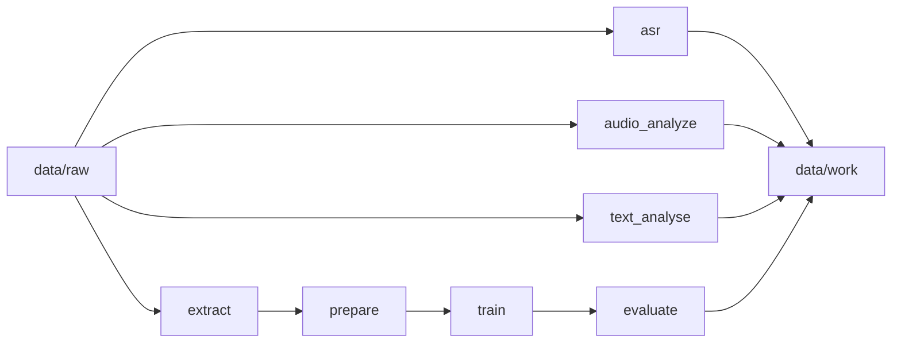

# ML Pipeline Skeleton

Base minimale pour un projet de machine learning orienté texte et audio.

## Structure

```text
.
├── README.md
├── data
│   ├── corpus
│   │   └── sample_corpus.json
│   ├── raw
│   │   ├── sample_audio.mp3
│   │   └── sample_text.txt
│   └── work
│       └── work.json
└── src
    └── script
        ├── __init__.py
        ├── asr.py
        ├── audio_analyze.py
        ├── evaluate.py
        ├── extract.py
        ├── prepare.py
        ├── text_analyse.py
        └── train.py
```

## Conventions de base

- Garder `data/raw/` pour les sources brutes, jamais modifiées.
- Écrire les artefacts intermédiaires dans `data/work/`.
- Conserver les exemples de corpus versionnés dans `data/corpus/`.
- Utiliser un module Python par étape métier.
- Prévoir un `main()` simple dans chaque script pour tester rapidement.

## Pipeline minimal

1. `extract` lit les fichiers bruts et référence les entrées.
2. `prepare` nettoie et structure les données.
3. `train` entraîne un modèle de base.
4. `evaluate` calcule les métriques.
5. `asr`, `audio_analyze` et `text_analyse` couvrent les traitements spécialisés.

## Lancement rapide

```bash
python -m src.script.extract
python -m src.script.prepare
python -m src.script.train
python -m src.script.evaluate
```

Ou via `make` :

```bash
make help
make pipeline
make asr
make audio
make text
```

## Diagramme


