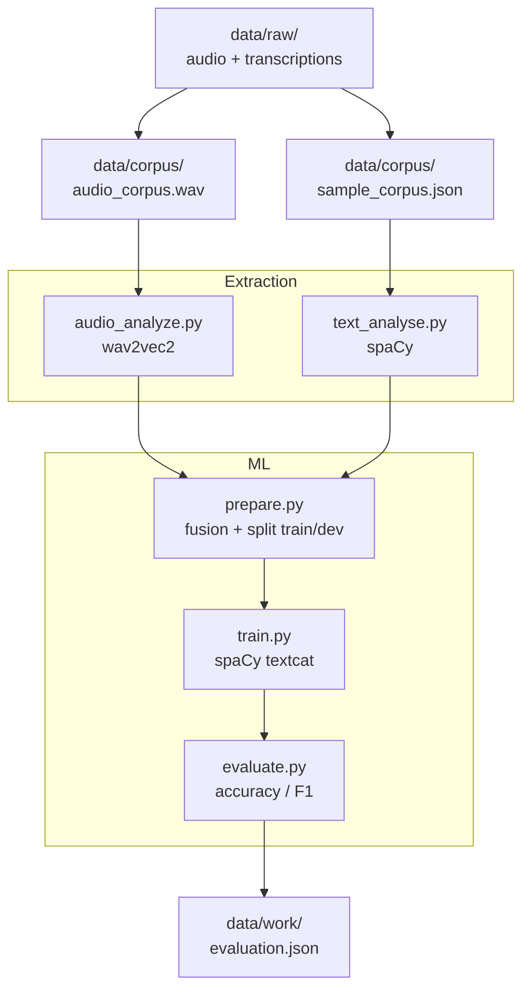

# Pipeline NLP audio+texte

Classification binaire supervisee (1=oui / 0=non) a partir d'audio et de leurs transcriptions.

## Structure

```text
.
├── requirements.txt
├── Makefile
├── data/
│   ├── raw/
│   │   ├── sample_audio.mp3
│   │   └── sample_text.txt
│   ├── corpus/
│   │   └── sample_corpus.json
│   └── work/               <- artefacts generes, ne pas versionner
│       ├── audio_features.json
│       ├── text_features.json
│       ├── prepared.json
│       ├── model/
│       └── evaluation.json
└── src/
    └── script/
        ├── audio_analyze.py
        ├── text_analyse.py
        ├── prepare.py
        ├── train.py
        └── evaluate.py
```

## Conventions

- `data/raw/` contient les sources brutes, jamais modifiees.
- `data/corpus/` contient le corpus versionne (audio + transcription + label).
- `data/work/` recoit tous les artefacts intermediaires (gitignore).
- Un module Python par etape, chaque script est executable directement.
- `pandas` pour la manipulation des donnees, `glob` pour la decouverte de fichiers.

## Diagramme



## Lancement

```bash
make install    # installe les dependances
make pipeline   # execute tout le pipeline
```

Ou etape par etape :

```bash
make audio
make text
make prepare
make train
make evaluate
```
